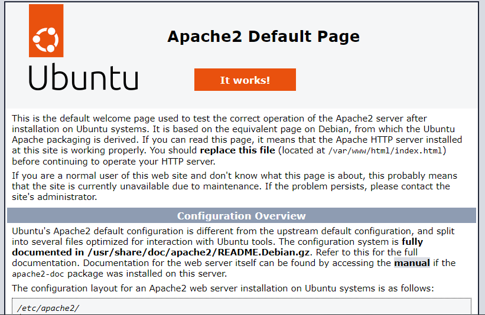
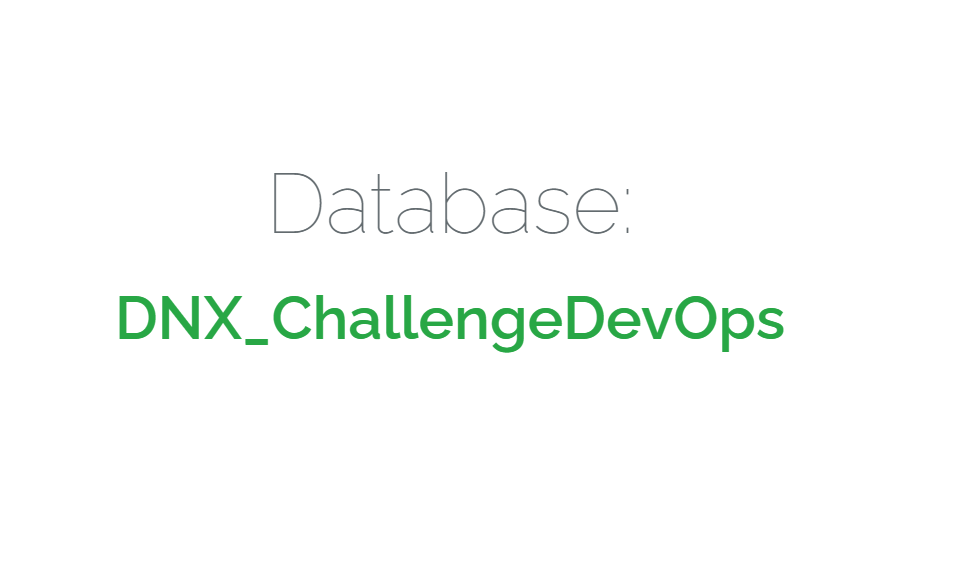

# First Challenge

Hello, welcome to our first challenge.\
Let's start small, deploying this application on an EC2, with a MySQL installed and running inside the instance.\
You will need to create and present to us in our next session, the following infrastructure up and running + the application working there.


## Below, the list of the things to create

|  | Task |
|------|-------------|
|1|Create an AWS VPC|
|2|Create an Ubuntu Server using AWS EC2|
|3|Install All the necessary dependencies in the EC2: Apache, MySQL, PHP, PHP extensions, Composer and etc.|
|4|Deploy and config the application into the EC2|
|5|Be prepared to show us your work next week :)|

## Solution

### Create an AWS Custom VPC

Log into your AWS console, select the region in which you would like to work (example: us-east-1 - N.Virginia) then select the VPC option.

Now, click on **Your VPCs** in the left sidebar and then click on **Create VPC.**

Give a name to your VPC and the IPv4 CIDR block that you would like.

You can enforce the tenancy of EC2 instances launched in this VPC. If you select **dedicated** then all your instances will be launched on dedicated tenancy instances (more cost). If you select the **Default** option then instances will use the tenancy option selected while launching them.

When you create a new VPC, a Network Access Control List (NACL) and the main Route Table is created by default.

    IPv4 CIDR block: "10.100.0.0/16"
    Tenancy: "Default"
    Tags:
    - Name: "dnx-vpc"
    - Environment: "staging"

### Create a Internet Gateway and Attach to the VPC

Without an internet gateway attached, any instance created inside that VPC cannot be accessed via the internet.

To create an internet gateway go to the **Internet Gateways** tab in the left sidebar and click on **Create Internet Gateway** at the top. Give a name to your internet gateway and click on **Create internet gateway** button.

You need to attach the internet gateway with your custom VPC. You can do this by selecting it, clicking on the **Actions** dropdown at the top and selecting **Attach to VPC**. Select the VPC created then click on **Attach internet gateway**.

Then select your custom VPC and click on the **Attach** button.

    VPC ID: "dnx-vpc"
    
    Tags:
    - Name: "dnx-igw"
    - Environment: "staging"

### Create a Public Subnet

Let's create the public subnets by selecting the **Subnets** tab from the left sidebar and clicking on the **Create Subnet** button.

You can give it a friendly name to easily identify it, then select the custom VPC and an IPv4 CIDR block for this subnet.

You can also select the AZ in which you would like to create this subnet since a subnet always maps to one AZ.

Once done, click on the **Create** button to create the subnet.

By default, subnets have the **Auto-Assign Public IP** setting as disabled. Let's enable this for our public subnet by selecting it and clicking on the **Actions** dropdown at the top and selecting **Modify auto-assign IP settings.**

Now, select the checkbox and click on the **Save** button.

    VPC ID: "dnx-vpc"
    Name: "dnx-public-subnet"
    Availability Zone: "us-eats-1a"
    Pv4 CIDR block: "10.100.11.0/24"
    
    Tags:
    - Name: "dnx-public-subnet"
    - Environment: "staging"

After creating the subnet, select it and click on **Actions** at the top of the screen. Then, choose **Edit subnet settings**, select the **Enable auto-assign public IPv4 address** option, and click **Save**.

### Create a Route Table

For security reasons, it is recommended to leave the main route table as it is. Hence, we will be creating a new route table for our custom VPC and allow internet access to our public subnet through it.

Let's head to the **Route Tables** tab from the left sidebar and click on the **Create route table** button at the top.

Give a name to your route table, select the custom VPC and click on the **Create route table** button.

### Associate subnet with Route Table

By default, all subnets are associated with the main route table. Let's associate the public subnet with the custom route table by selecting it and naviga
ting to the **Subnet Associations** tab at the bottom.

Click on the **Edit subnet associations** and select the public subnet and click on the **Save associations** button.

### Allow internet access

To allow internet access to your public subnet you need to create a new Route for your custom route table.

Select the custom route table and navigate to the **Routes** tab at the bottom. Click on the **Edit Routes** button and add a new Route with the destination as **0.0.0.0/0** and target as the attached internet gateway.

    VPC ID: "dnx-vpc"
    Explicit subnet associations: "dnx-public-subnet"
    Routes:
    - Destination: "0.0.0.0/0" | Target: *"dnx-igw"
    - Destination: "10.100.0.0/16" | Target: *"local"

    Tags:
    - Name: "dnx-rtb"
    - Environment: "staging"

### Create a Security Group

Now let's create a security group with ports 22 and 80 open to the internet. You're opening port 22 because you're going to connect to your public instance to be able to configure your application using the SSH protocol.

Select **Security groups** from the left sidebar and clicking on **Create security group**. Give it a name to easily identify it, then select the custom VPC then click on **Add rule**.

    Security group name: "dnx-scg"
    Description: "Allow acess to EC2 Instance"
    VPC ID: "dnx-vpc"

    Inbound rules:
    - Type: SSH     | Protocol: TCP | Source type: My IP | Source: "you IP address"
    - Type: HTTP    | Protocol: TCP | Source type: My IP | Source: "you IP address"
        
    Outbound rules:
    - Type: All traffic | Protocol: TCP | Destination: "0.0.0.0/0"
            
    Tags:
    - Name: "dnx-scg"
    - Environment: "Challenge-DevOps"

### Create a Key Pair

A key pair, consisting of a public key and a private key, is **a set of security credentials that you use to prove your identity when connecting to an Amazon EC2 instance**. Amazon EC2 stores the public key on your instance, and you store the private key.

Open the Amazon EC2 console.

In the navigation pane, under **Network & Security**, choose **Key Pairs**.

Choose **Create key pair**.

For **Name**, enter a descriptive name for the key pair.

For **Key pair type**, choose either **RSA** or **ED25519**.

For **Private key file format**, choose the format in which to save the private key. To save the private key in a format that can be used with OpenSSH, choose **pem**. To save the private key in a format that can be used with PuTTY, choose **ppk**.

Choose **Create key pair**.

The private key file is automatically downloaded by your browser. The base file name is the name that you specified as the name of your key pair, and the file name extension is determined by the file format that you chose. Save the private key file in a safe place.

    Key pair name: "dnx-key-pair"
    Key pair type: "RSA"
    Private key file format: ".pem"

### Create an Ubuntu Server EC2 Instance

It's time to launch your instances. Head over to the EC2 dashboard and click on **Launch Instances**.

Select the **Ubuntu Server 22.04 LTS** and choose the instance type **t2.micro** since it's available in the Free Tier.

In the next steps, select the Key pair, the custom VPC as the network and the subnet (in the field just below the subnet, you can see the field **Auto-assign Public IP**. Since in your subnet, you enabled this option so the default option here is **Enable.**). 

Select existing security group and choose the security group that you have created before then click on **Launch instance**

    Application and OS Images: "Ubuntu, 22.04 LTS"
    Instance type: "t2.micro"
    Key pair: "dnx-key-pair"
    VPC ID: "dnx-vpc"
    Subnet: "dnx-public-subnet"
    Auto-assign public IP: "Enable"
    Security groups: "dnx-scg"
    Configure storage: "8 GiB gp2"

    Tags:
    - Name: "dnx-svr"
    - Environment: "Challenge-DevOps"

### Connect to EC2 Instance via SSH

It's time to SSH into your instance. Open an SSH client. (example: Windows PowerShell), locate your private key file then connect to your instance using its Public IP:

```bash
    ssh -i "key-pair.pem" "user-name"@"public-ip-address"
```

To confirm that your instance has internet access you can run `sudo apt-get update` and see that it's working.

### Deploy Laravel Project

Laravel is the most popular PHP framework to build web applications fast. 

First of all, You must have a LAMP (Linux, Apache, MySQL and PHP) stack properly configured on your server. 

#### Set up Apache with PHP-FPM on Ubuntu

Execute the following commands on your server to install Apache

```bash
    sudo apt-get update && sudo apt-get upgrade -y
    sudo apt-get install apache2 -y
    sudo a2enmod actions
    sudo service apache2 restart
```

Once the process is complete, verify the Apache installation by visiting your server's public IP address on your browser.

If you see the default Apache page like the following image, you have successfully installed  Apache on your server.



#### Install and Configure PHP 7.4

##### **Install Required Packages**

The following dependencies will need to be installed to install PHP 7.4 successfully. Most of these packages would already be present on your system, but running the command can help ensure they are installed.

```bash
sudo apt install software-properties-common apt-transport-https -y
```

##### **Import Ondrej Sury PHP Repository**

To begin with, import the PHP repository by Ondrej, who has been a PHP maintainer for Debian for over a decade and is widely used amongst Ubuntu servers and users.

Import the PPA using the following command.

```bash
sudo add-apt-repository ppa:ondrej/php -y
```

Once done, it is good to refresh your APT repositories as the PPA may bring additional upgrades to existing dependencies.

```bash
sudo apt-get update && sudo apt-get upgrade -y
```

Besides PHP itself, you will likely want to install some additional PHP modules. Here are a few suggestions of the most common modules you will most likely want to install:

```bash
sudo apt-get install php7.4 php7.4-cli php7.4-json libapache2-mod-php7.4 php7.4-common php7.4-mysql php7.4-zip php7.4-gd php7.4-mbstring php7.4-curl php7.4-xml php7.4-bcmath unzip -y
```

Once installation is complete, restart your Apache server to load the new PHP module.

```bash
sudo systemctl restart apache2
```

You can execute the following command to see if the PHP was installed.

```bash
php -v
```

#### Installing PHP Composer

Composer is a popular dependency management tool for PHP, created mainly to facilitate installation and updates for project dependencies. It will check which other packages a specific project depends on and install them for you, using the appropriate versions according to the project requirements. Composer is also commonly used to bootstrap new projects based on popular PHP frameworks, such as Symfony and Laravel.

The Composer’s official team provides a script to install PHP composer on Linux systems. You can download this script using the `curl` or `wget` command-line utility. Also, you can download it directly using the PHP script command line.

To download the `composer-setup` script, run the following command in a terminal:

```bash
php -r "copy('https://getcomposer.org/installer', 'composer-setup.php');" 
```

Then execute the downloaded PHP script to install the composer on your Ubuntu system.

```bash
sudo php composer-setup.php --install-dir=/usr/local/bin --filename=composer
sudo chmod +x /usr/local/bin/composer
```

To see the installed composer version execute binary with -v command parameter.

```bash
composer --version
```

#### Install and Configure MySQL

To install MySQL on your server, execute the following command.

```bash
sudo apt-get install mysql-server mysql-client -y
```

Set the root password.

```bash
sudo mysql
mysql> ALTER USER 'root'@'localhost' IDENTIFIED WITH mysql_native_password BY 'pa$$word';
mysql> exit
```

Then, execute the following command to secure your MySQL server.

```bash
sudo mysql_secure_installation
```

It will ask you some questions. The first thing it will ask you is if you want to enable the Validate Password plugin. I recommend you to enable this plugin as it will set the standard for setting the strong password.

After that, it will ask you four more questions. Answer them according to your requirements.

    VALIDATE PASSWORD COMPONENT? Press Y, then 2, then ENTER
    Change the password for root? Press N, then ENTER.
    Remove anonymous users? Press Y, then ENTER.
    Disallow root login remotely? Press Y, then ENTER.
    Remove test database and access to it? Press Y, then ENTER.
    Reload privilege tables now? Press Y, then ENTER.

Once done, Our MySQL server is successfully installed and configured on our server.

##### **Create A MySQL User with Permissions**

Here you are running all queries as root account having full privileges to all databases. You can create MySQL user account with required privileges.

Let’s create a new MySQL user within MySQL shell.

To login in the MySQL, execute the following command and inform the root password.

```bash
mysql -u root -p
```

To create a new user, execute the following comand.

```bash
mysql> CREATE USER 'newuser'@'localhost' IDENTIFIED BY 'pa$$word';
```

Here **newuser** is the username to be created. The **localhost** is defines that this user is only accessible from localhost only. To connect MySQL from any remote host, change the localhost with remote system ip address. You can also use % to allow any remote host to connect with this account.

Now, assign the required privileges to the newly created MySQL user.

```bash
mysql> GRANT ALL ON *.* TO 'newuser'@'localhost';
```

>**ALL** – This will allow a mysql user the complete access to the specified database or full access to all databases

After adding or modifying any privileges, make sure to reload the privilege’s to apply changes in running MySQL instance.

```bash
mysql> FLUSH PRIVILEGES;
mysql> exit
```

##### **Create Database**

To login in the MySQL, execute the following command and inform the new user password.

```bash
mysql -u newuser -p
```

Then, execute the following command to create a new database.

```bash
mysql> CREATE DATABASE "your_database_name";
```

To check if the database was created, execute the following command.

```bash
mysql> SHOW DATABASES;
mysql> exit
```

#### Install Git and clone the Git Repository

Git is the most popular version control system developed by the founder of Linux itself, Linux Torvalds. It is very easy to use and millions of developers around the world use git to manage different versions of their code.

To clone the git repository from github, you have to install git on your server. It is easy. So, Let's install the git on your server.

Execute the following commands to install git on Ubuntu server.

```bash
sudo apt-get update && sudo apt-get install git -y
```

Once the installation is complete, it's time to clone a git repository containing your Larvel project.

You will deploy the Laravel Application from DNXLabs GitHub repository. And you are going to deploy it inside the default document root of Apache webserver. It means that you will navigate to `/var/www/html/` and execute the git clone command, just like this.

```bash
cd /var/www/html
sudo git clone https://github.com/DNXLabs/ChallengeDevOps.git
```

##### **Install all dependencies using composer and set permissions**

```bash
cd /var/www/html/ChallengeDevOps
sudo composer install
sudo chown -R :www-data /var/www/html/ChallengeDevOps
sudo chmod -R 775 /var/www/html/ChallengeDevOps
```

#### Update the .env file and generate an encryption key

After cloning the git repository and setting the permissions, you have to create an `.env` file.

To copy the file from `.env.example` to `.env` and generate the application key and the JWT authentication secret key , execute the following commands.

```bash
cd /var/www/html/ChallengeDevOps
sudo cp .env.example .env
sudo php artisan key:generate
sudo php artisan jwt:generate
```

To open the .env file in edit mode to make the required configuration changes, execute the following command.

```bash
sudo nano /var/www/html/ChallengeDevOps/.env
```

Update the DB block with your Database details

    DB_CONNECTION=mysql
    DB_HOST=localhost
    DB_PORT=3306
    DB_DATABASE="database_name"
    DB_USERNAME="newuser"
    DB_PASSWORD="newuser_password"

After updating your .env file, press **CTRL+X** followed by **Y** followed by the **Enter** key to save the updated .env file

#### Run the Database migrations 

To run the Database migrations, execute the following command.

```bash
sudo php artisan migrate
```

#### Adjust the virtualhost file

Because the main `index.php` file of the project resides in the `/ChallengeDevOps/public` directory of the project, you have to update your virtual host in such a way that it should route the traffic into the `/ChallengeDevOps/public` directory.

You just have to add `/ChallengeDevOps/public` at the end of the `DocumentRoot` and at other places in the virtual host file where you have to define the document root of our project. 

To open your virtual host file in edit mode, execute the following command.

```bash
sudo nano /etc/apache2/sites-available/challengedevops.conf
```

Now, add `/public` at the end of the **documentRoot** so that Apache will route all the traffic inside the `/public` route that holds the main `index.php` file of our project.

For example, Here is the updated default virtual host configuration file.

    <VirtualHost *:80>

        ServerAdmin webmaster@localhost
        ServerName localhost
        DocumentRoot /var/www/html/ChallengeDevOps/public

        <Directory /var/www/html/ChallengeDevOps>
            Options Indexes MultiViews
            AllowOverride None
            Require all granted
        </Directory>
        
        ErrorLog ${APACHE_LOG_DIR}/error.log
        CustomLog ${APACHE_LOG_DIR}/access.log combined

    </VirtualHost>

After updating your virtual host file, press **CTRL+X** followed by **Y** followed by the **Enter** key to save the updated virtual host file. 
Now, you have to enable the Apache rewrite module, activate the Laravel virtual host and restart the Apache server to apply the changes. Execute the following commands.

```bash
sudo a2enmod rewrite
sudo a2dissite 000-default.conf
sudo a2ensite challengedevops.conf
sudo systemctl restart apache2
```

After restarting the Apache server, we will be able to access our Laravel project in the browser with the EC2 Instance public IP address.


