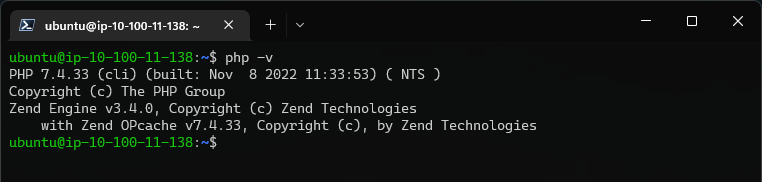
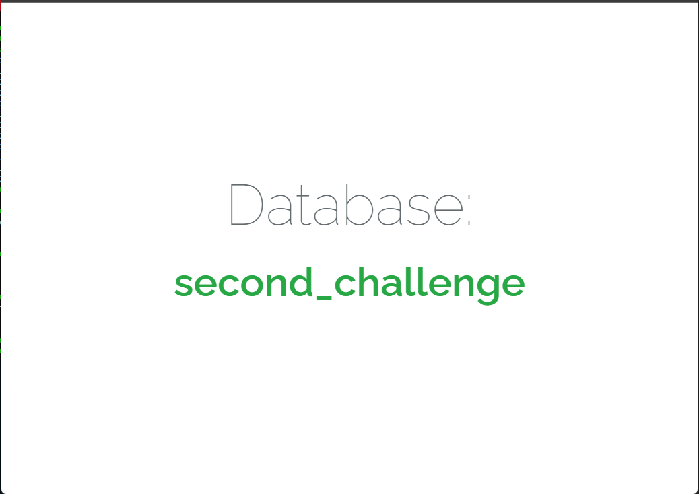

# Second Challenge

Let's start decoupling our architecture.\
In the first challenge, we created and deployed our application using an EC2.\
In this session, we've learnt a bit about ALB and RDS and in the next challenge, we will be making use of these resources.


## Below, a summary of your next tasks

|  | Task |
|------|-------------|
|1|Create a Private Subnet in your VPC |
|2|Create a new Ubuntu Server using EC2 in the private Subnet |
|3|Create an RDS for MySQL also in the private Subnet |
|4|Create an Application Load Balancer in the public Subnet|
|5|Install All the necessary dependencies in the EC2, and deploy your laravel application. However, your MySQL will be now in RDS instead of installed in the EC2.|
|6|To access your application, we should go now through the ALB.|
|7|See you next session :)|

## Solution

### Creating Private and Public Subnets

To meet one of the requirements of this challenge, it will be necessary to use an ALB (Application Load Balancer). To configure an ALB, you need to use at least two Availability Zones, because if one of the zones goes down, the ALB will direct all traffic to the other. Following the challenge requirements, you need to create 2 subnets in each AZ (one public and one private).

#### Create the Public Subnets

A public subnet is a subnet that is associated with a route table that has a route to an Internet gateway. Internet gateway connects the VPC to the Internet and to other AWS services. The resources in the public subnet can send outbound traffic directly to the Internet and vice versa.

Let's create one more public subnet by selecting the **Subnets** tab from the left sidebar in the VPC section and clicking on the **Create Subnet** button.

>You must select a different Availability Zone (AZ) for each public subnet.

Once done, click on the **Create** button to create the subnet.

After creating the subnet, select it and click on **Actions** at the top of the screen. Then, choose **Edit subnet settings**, select the **Enable auto-assign public IPv4 address** option, and click **Save**.

>By default, subnets have the **Auto-Assign Public IP** setting as disabled.

```
VPC ID: "dnx-vpc"
Name: "dnx-public-subnet"
Availability Zone: "us-eats-1a"
Pv4 CIDR block: "10.100.11.0/24"
Enable auto-assign public IPv4 address: "True"

Tags:
- Name: "dnx-public-subnet"
- Environment: "staging"
```

```
VPC ID: "dnx-vpc"
Name: "dnx-public-subnet2"
Availability Zone: "us-eats-1b"
Pv4 CIDR block: "10.100.12.0/24"
Enable auto-assign public IPv4 address: "True"

Tags:
- Name: "dnx-public-subnet2"
- Environment: "staging"
```

In a similar way, you can now create the private subnets.

#### Create the Private Subnets

A private subnet is a subnet that is associated with a route table that doesn’t have a route to an internet gateway. Instances in the private subnet are backend servers they don’t accept the traffic from the internet. Resources like database may require connection to internet for updates/patches but should not be accepting request from the internet.

>The procedure for creating the private subnets is the same as for creating public subnets, however you must not enable the option Enable auto-assign public IPv4 address.

```
VPC ID: "dnx-vpc"
Name: "dnx-private-subnet"
Availability Zone: "us-eats-1a"
Pv4 CIDR block: "10.100.21.0/24"

Tags:
- Name: "dnx-private-subnet"
- Environment: "staging"
```

```
VPC ID: "dnx-vpc"
Name: "dnx-private-subnet2"
Availability Zone: "us-eats-1b"
Pv4 CIDR block: "10.100.22.0/24"    

Tags:
- Name: "dnx-private-subnet2"
- Environment: "staging"
```

### Route Tables

To meet another of the requirements of this challenge, 2 route tables are required (one for the public subnets and the other for the private subnets). As we already have a public route table, let's now create a private route table.

Let's head to the **Route Tables** tab from the left sidebar and click on the **Create route table** button at the top.

>For security reasons, it is recommended to leave the main route table as it is. Hence, we will be creating a new route table for our custom VPC and allow internet access to our public subnet through it.

#### Associating subnets with the Route Tables

By default, all subnets are associated with the main route table. Let's associate the public subnets with the public route table and the private subnets with the private route table by selecting the rote tables and navigating to the **Subnet Associations** tab at the bottom.

Click on the **Edit subnet associations** and select the subnets (according to the type of route table) and click on the **Save** button.

```
VPC ID: "dnx-vpc"
Explicit subnet associations: "dnx-public-subnet","dnx-public-subnet2"
Routes:
- Destination: "0.0.0.0/0" | Target: "dnx-igw"
- Destination: "10.100.0.0/16" | Target: "local"

Tags:
- Name: "dnx-rtb"
- Environment: "staging"
```

```
VPC ID: "dnx-vpc"
Explicit subnet associations: "dnx-private-subnet","dnx-private-subnet2"
Routes:
- Destination: "10.100.0.0/16" | Target: "local"

Tags:
- Name: "dnx-rtb-private"
- Environment: "staging"
```

### Security Groups

Now let's create the security groups. For this challenge you will need 4 security groups. One for the application server, one for the ALB, one for the RDS and finally one for our NAT Instance. Both for the Application Server and for the NAT instance we will open port 22 so that we can configure our application.

```
Security group name: "dnx-alb-scg"
Description: "Allow acess to ALB"
VPC ID: "dnx-vpc"

Inbound rules:
- Type: HTTP        | Protocol: TCP | Source: "0.0.0.0/0"
    
Outbound rules:
- Type: All traffic | Protocol: All | Destination: "0.0.0.0/0"
    
Tags:
- Name: "dnx-alb-scg"
- Environment: "staging"
```

```
Security group name: "dnx-nat-scg"
Description: "Allow acess to EC2 NAT Instance"
VPC ID: "dnx-vpc"

Inbound rules:
- Type: SSH         | Protocol: TCP | Source type: My IP | Source: "you IP address"
- Type: HTTP        | Protocol: TCP | Source: "dnx-svr-scg"  
    
Outbound rules:
- Type: All traffic | Protocol: All | Destination: "0.0.0.0/0"
    
Tags:
- Name: "dnx-nat-scg"
- Environment: "staging"
```

```
Security group name: "dnx-svr-scg"
Description: "Allow acess to private EC2 Instances"
VPC ID: "dnx-vpc"

Inbound rules:
- Type: SSH     | Protocol: TCP | Source: "dnx-nat-scg"
- Type: HTTP    | Protocol: TCP | Source: "dnx-alb-scg"        

Outbound rules:
- Type: All traffic | Protocol: TCP | Destination: "0.0.0.0/0"        

Tags:
- Name: "dnx-scg"
- Environment: "staging"
```

```
Security group name: "dnx-rds-scg"
Description: "Allow acess to RDS"
VPC ID: "dnx-vpc"

Inbound rules:
- Type: MYSQL/Aurora   | Protocol: TCP | Source: "dnx-svr-scg"
    
Outbound rules:
- Type: All traffic | Protocol: All | Destination: "0.0.0.0/0"
    
Tags:
- Name: "dnx-rds-scg"
- Environment: "staging"
```

### Create a Key Pair

A key pair, consisting of a public key and a private key, is **a set of security credentials that you use to prove your identity when connecting to an Amazon EC2 instance**. Amazon EC2 stores the public key on your instance, and you store the private key.

Open the Amazon EC2 console.

In the navigation pane, under **Network & Security**, choose **Key Pairs**.

Choose **Create key pair**.

For **Name**, enter a descriptive name for the key pair.

For **Key pair type**, choose either **RSA** or **ED25519**.

For **Private key file format**, choose the format in which to save the private key. To save the private key in a format that can be used with OpenSSH, choose **pem**. To save the private key in a format that can be used with PuTTY, choose **ppk**.

Choose **Create key pair**.

The private key file is automatically downloaded by your browser. The base file name is the name that you specified as the name of your key pair, and the file name extension is determined by the file format that you chose. Save the private key file in a safe place.

```
Key pair name: *"dnx-key-pair"*
Key pair type: *"RSA"*
Private key file format: *".pem"*
```

### Private EC2 Instance (Ubuntu Server)

It's time to launch your private instance. Head over to the EC2 dashboard and click on **Launch Instance**. Select the **Ubuntu Server 22.04 LTS** and choose an instance type (t2.micro is available in the Free Tier)

In the next step select the Key pair, the custom VPC, the private subnet and the security group (select existing security group and choose the security group that you have created before).

Now, add some storage and give some name to your instance.

```
Application and OS Images: "Ubuntu, 22.04 LTS"
Instance type: "t2.micro"
Key pair: "dnx-key-pair"
VPC ID: "dnx-vpc"
Subnet: "dnx-private-subnet"
Auto-assign public IP: "Disable"
Security groups: "dnx-svr-scg"
Configure storage: "8 GiB gp2"

Tags:
- Name: "dnx-svr-private"
- Environment: "staging"
```

### NAT Instance and Bastion Host

Private subnets in an AWS VPC must be associated with a NAT gateway or a NAT instance to be able to access the internet. A NAT gateway will always be the best choice for a production environment - they are managed, highly scalable, and highly available. But NAT instances are still a good option for who want to minimize their monthly cloud bill.

NAT instances were the old way to provide internet connectivity to the instances. An intance behind a NAT can initiate a connection to internet, but an new connection attempt from internet to the instance would be blocked. NAT allows intances to open connections to internet but not the other way around.

A Bastion host is a special-purpose server or an instance that is used to configure to work against the attacks or threats. It is also known as the ‘jump box’ that acts like a proxy server and allows the client machines to connect to the remote server. It is basically a gateway between the private subnet and the internet. It allows the user to connect private network from an external network and act as  proxy to other instances.

Head over to the EC2 dashboard and click on **Launch Instance**. Select the **Amazon Linux 2023 AMI** and choose an instance type. In the next step select the Key pair, the custom VPC as the network, the public subnet and the security group.

In advanced details, go to "User Data" and paste the following script to install and configure the IPTables.

```bash
sudo yum install iptables-services -y
sudo systemctl enable iptables
sudo systemctl start iptables
sudo sysctl -w net.ipv4.ip_forward=1
sudo /sbin/iptables -t nat -A POSTROUTING -o eth0 -j MASQUERADE
sudo service iptables save
```

Then click on **Launch Instance**.

```
Application and OS Images: "Amazon Linux 2023 AMI"
Instance type: "t2.micro"
Key pair: "dnx-key-pair"
VPC ID: "dnx-vpc"
Subnet: "dnx-public-subnet"
Auto-assign public IP: "Enable"
Security groups: "dnx-nat-scg"
Configure storage: "8 GiB gp2"

Tags:
- Name: "dnx-svr-private"
- Environment: "staging"
```

### Update the private route table

After creating the NAT Instance, it is necessary to adjust the private route table. To do this, go to **VPC** then **Route Tables**. Select the **Private Route Table** and in the routes tab select **Edit routes**. Specify **0.0.0.0/0** for **Destination** and the **instance ID** of the **NAT instance (dnx-nat-inst)** for **Target**.

### Listeners, Routing and Target Group

A listener is a process that checks for connection requests, using the protocol and port you configure while creating your AWS Application Load Balancer.

Target groups route requests to one or more registered targets, such as EC2 instances, using the protocol and port number that you specify. You can register a target with multiple target groups. You can configure health checks on a per target group basis. Health checks are performed on all targets registered to a target group that is specified in a listener rule for your load balancer.

To creating a new Target Group you will click on **Create a target group**. Note that here traffic on port 80 will be forwarded to the Target Group created.

First, you will specify group details. Note that our load balancer will route requests to the targets in a target group and performs health checks on the targets as well. Targets can be of different types such as **Instances, IP addresses, Lambda function,** and even an AWS **Application Load Balancer**. We will keep our target to be **Instances** that we created above. Give a name to the Target Group, select the VPC and leave the other options in default and click next.

The next step is to register the targets. Here you can see the instances you created previously. Select the **EC2 private Instance** and click on **Include as pending below** then click on **Create target group**

### Application Load Balancer

The Application Load Balancer distributes incoming HTTP and HTTPS traffic across multiple targets such as Amazon EC2 instances, microservices, and containers, based on request attributes. When the load balancer receives a connection request, it evaluates the listener rules in priority order to determine which rule to apply, and if applicable, it selects a target from the target group for the rule action.

On EC2, in the left pane, click **Load Balancers** then click on **Create load balancer**. Here you can find four types of Load Balancers. Select **Aplication Load Balancer** and click on **Create**.

Here you will provide the name of your Load Balancer and you will keep it to be **Internet-facing** as you want your load balancer to route requests from clients over the internet to target that in your case will be the EC2 instances. You can select the type of **IP addresses** that your subnets will use, for now, you will leave it to **IPV4**.

Now you will select at least two Availability Zones and one subnet per zone so that the load balancer will route traffic to targets in these Availability Zones only. Select the
ALB security group created previously.

In **Listeners and routing**, select the **Target Group** created earlier. Finally, click on **Create load balancer**

#### Target Group

```
Target type: Instances
Target group name: "dnx-private-trg"
Protocol: "HTTP"
Port: "80"
VPC: "dnx-vpc"
Protocol version: "HTTP1"
Health check protocol: "HTTP"
Health check path: "/"
Instances: dnx-svr-private

Tags:
- Name: "dnx-private-trg"
- Environment: "staging"
```

#### Load Balancer

```
Type: "Application Load Balancer"
Name: "dnx-alb"
Scheme: "Internet-facing"
IP address type: "IPv4"
VPC: "dnx-vpc"
Mappings:
- "ap-southeast-2a - dnx-public-subnet-01"
- "ap-southeast-2b - dnx-public-subnet-02"
Security Group: "dnx-alb-scg"
Listeners and routing
- "Listener:  HTTP:80  Forward to dnx-private-trg (HTTP)"

Tags:
- Name: "dnx-alb"
- Environment: "staging"
```

### RDS MySQL instance

Amazon RDS allocates users EC2 instances developed specifically for database management. These database instances can be based on any of the following six relational database engines: MySQL, MariaDB, PostgreSQL, Oracle, SQL Server, and Aurora. We can create and manage databases on these instances, just as we would on our local machine.

### RDS Subnet Groups

An RDS Subnet Group is a collection of subnets that you can use to designate for your RDS database instance in a VPC. The database within your VPC will use the Subnet Group and the preferred Availability Zone to select a subnet and an IP address within that subnet. An Elastic Network Interface will be associated to the database instance with that IP address. Note that each DB Subnet Group should have at least one subnet for every Availability Zone in a given Region.

#### Create a RDS Subnet Groups

```
Name: dnx-rds-subnet-grp
VPC: dnx-vpc
Availability zone:
- ap-southeast-2a
- ap-southeast-2b
Subnet:
- dnx-subnet-private1 (10.100.21.0/24)
- dnx-subnet-private2 (10.100.22.0/24)
```

#### Create RDS MySQL instance in the Private Subnet

```
Engine: *"MySQL"*
Version: *"8.0.28"*
Template: *"Free tier"*
DB instance identifier: *"your-db-identifier"*
Master username: *"your-root-user"*
Master Password: *"your-root-password"*
Instance config: *"db.t2.micro"*
Storage type: *"General Purpose SSD (gp2)"*
Allocate storage: *"20 GiB"*
Storage autoscaling: *"Disable"*
Compute resource: *"Don’t connect to an EC2 compute resource"*
VPC: *"dnx-vpc"*
DB Subnet group: *"dnx-rds-subnet-grp"*
Public access: *"No"*
VPC security groups: *"dnx-rds-scg"*
Availability Zone: *"ap-southeast-2a"*
Database port: *"3306"*
Database authentication: *"Password authentication"*
Initial database name: *"your-database-name"*
Enable automated backups: *"Disable"*

Tags:
- Name: *"dnx-rds"*
- Environment: *"Challenge-DevOps"*
```

### Deploy Laravel Project

#### Conect to NAT Instance to use them as a Bastion Host

Coneect to NAT Instance

```bash
eval $(ssh-agent)
```

```bash
ssh-add "/path/to/key.pem"
```

```bash
ssh-add -l
```

Coneect to NAT Instance

```bash
ssh -A ec2-user@Bastion_Host_IP_Address
```

Connect to Private Instance through Bastion Host

```bash
ssh ubuntu@Private_instance_IP_address
```

#### Set up Apache with PHP-FPM on Ubuntu

Execute the following commands on your server to install Apache

```bash
sudo apt-get update && sudo apt-get upgrade -y
sudo apt-get install apache2 -y
sudo a2enmod actions
sudo systemctl restart apache2
```

Once the process is complete, verify the Apache installation by visiting your ALB DNS name address on your browser.

If you see the default Apache page like the following image, you have successfully installed  Apache on your server.


#### Install and Configure PHP 7.4

#### Install Required Packages

The following dependencies will need to be installed to install PHP 7.4 successfully. Most of these packages would already be present on your system, but running the command can help ensure they are installed.

```bash
sudo apt install software-properties-common apt-transport-https -y
```

#### Import Ondrej Sury PHP Repository

To begin with, import the PHP repository by Ondrej, who has been a PHP maintainer for Debian for over a decade and is widely used amongst Ubuntu servers and users.

Import the PPA using the following command.

```bash
sudo add-apt-repository ppa:ondrej/php -y
```

Once done, it is good to refresh your APT repositories as the PPA may bring additional upgrades to existing dependencies.

```bash
sudo apt-get update && sudo apt-get upgrade -y
```

#### Install PHP 7.4 with Apache Option

To install PHP 7.4 as an Apache module and the others dependencies, enter the following command.

```bash
sudo apt-get install libapache2-mod-php7.4 php7.4 php7.4-common php7.4-xml php7.4-curl php7.4-mysql php7.4-fpm php7.4-gd php7.4-opcache php7.4-mbstring php7.4-tokenizer php7.4-json php7.4-bcmath php7.4-zip unzip -y
```

Once installation is complete, restart your Apache server to load the new PHP module.

```bash
sudo systemctl restart apache2
```

You can execute the following command to see if the PHP was installed.

```bash
php -v
```



#### Install Git and Composer

To clone the git repository from github, we have to install git on our server. It is easy. And, we also have to install composer on the server because we have to install Laravel's dependencies using `composer update` or `composer install` command. So, Let's first install the git and composer on our server.

Execute the following commands to install git and composer on Ubuntu server.

```bash
sudo apt-get update
sudo apt-get install git composer -y
```

Execute the following command to check if the composer was installed.

```bash
sudo composer --version
```

Once the installation is complete, it's time to clone a git repository containing your Larvel project.

#### Clone Git Repository

Git is the most popular version control system developed by the founder of Linux itself, Linux Torvalds. It is very easy to use and millions of developers around the world use git to manage different versions of their code.

We will deploy the Laravel Application from DNXLabs GitHub repository. And we are going to deploy it inside the default document root of Apache webserver. It means that we will navigate to `/var/www/html/ChallengeDevOps` and execute the git clone command, just like this.

```bash
cd /var/www/html
sudo git clone https://github.com/DNXLabs/ChallengeDevOps.git
```

#### Install all the dependencies using composer and set permissions

```bash
cd
curl -sS https://getcomposer.org/installer | php
sudo mv composer.phar /usr/local/bin/composer
cd /var/www/html/ChallengeDevOps
sudo composer update
sudo chown -R :www-data /var/www/html/ChallengeDevOps
sudo chmod -R 775 /var/www/html/ChallengeDevOps
```

#### Update the .env file and generate an encryption key

After cloning the git repository, we have to create an `.env` file. We copy the `.env.example` file and then update the contents inside the copied `.env` file.

To copy the file from `.env.example` to `.env` and generate the application key and the JWT authentication secret key , execute the following commands.

```bash
cd /var/www/html/ChallengeDevOps
sudo cp .env.example .env
sudo php artisan key:generate
sudo php artisan jwt:generate
```

To open the .env file in edit mode to make the required configuration changes, execute the following command.

```bash
sudo vi /var/www/html/ChallengeDevOps/.env
```

Update the DB block with your Database details

```
>DB_CONNECTION=mysql
>DB_HOST=Database-Endpoint
>DB_PORT=3306
>DB_DATABASE="database_name"
>DB_USERNAME="root_user"
>DB_PASSWORD="root_password"
```

After updating your .env file, press **CTRL+X** followed by **Y** followed by the **Enter** key to save the updated .env file

### Run the Database migrations

To run the Database migrations, execute the following command.

```bash
sudo php artisan migrate
```

### Adjust the virtualhost file

Because the main `index.php` file of the project resides in the `/ChallengeDevOps/public` directory of the project, we have to update our virtual host in such a way that it should route the traffic into the `/ChallengeDevOps/public` directory.

We just have to add `/ChallengeDevOps/public` at the end of the `DocumentRoot` and at other places in the virtual host file where we have to define the document root of our project. 

To open your virtual host file in edit mode, execute the following command.

```bash
sudo vi /etc/apache2/sites-available/challengedevops.conf
```

Now, add `/public` at the end of the document root so that Apache will route all the traffic inside the `/public` route that holds the main `index.php` file of our project.

For example, Here is the updated default virtual host configuration file without comments.

```
<VirtualHost *:80>
	ServerAdmin webmaster@localhost
	ServerName localhost
	DocumentRoot /var/www/html/ChallengeDevOps/public

	<Directory /var/www/html/ChallengeDevOps>
		Options Indexes MultiViews
		AllowOverride None
		Require all granted
	</Directory>
	
	ErrorLog ${APACHE_LOG_DIR}/error.log
	CustomLog ${APACHE_LOG_DIR}/access.log combined

</VirtualHost>
```

After updating your virtual host file, press **CTRL+X** followed by **Y** followed by the **Enter** key to save the updated virtual host file. Now, we have to enable the Apache rewrite module, activate the Laravel virtual host and restart the Apache server to apply the changes. Execute the following commands.

```bash
sudo a2enmod rewrite
sudo a2dissite 000-default.conf
sudo a2ensite challengedevops.conf
sudo systemctl restart apache2
```

After restarting the Apache server, we will be able to access our Laravel project in the browser with the ALB DNS name address on your browser. 


