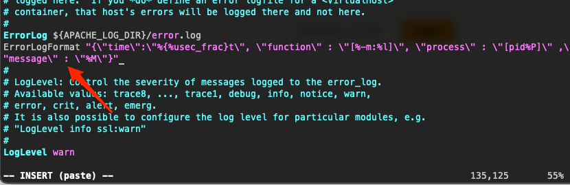

# Third Challenge

Let's start auto scaling our architecture.\
In this session, we've learnt a bit about Auto Scaling and CloudWatch. \
In the next challenge, we will be making use of these resources. \
Now, we will not create our instances manually, but using Auto Scaling. \
In this challenge, you will also need to create a Cloud Watch group, and send your Apache logs to it.


## Below, a summary of your next task

|  | Task |
|------|-------------|
|1|Create a CloudWatch Log Group|
|2|Create a Launch Configuration. This will be your instance configuration template and is used to launch your EC2 instances. You will need a new Load Balancer here, pointing it to use the target group created in the Launch Config. **Tip:** In this Launch Configuration you will be able to config your Cloud Watch Agent. |
|3|Create an Auto Scaling making use of the Launch Configuration above. |
|4|See you next session :)|

## Solution

### Create a new AWS IAM user

1. Create a new AWS IAM user and use custom IAM policy document below to ensure you EC2 instance can transmit logs to Amazon CloudWatch logs.

    ```json
    {
        "Version": "2012-10-17",
        "Statement": [
            {
                "Sid": "VisualEditor0",
                "Effect": "Allow",
                "Action": [
                    "cloudwatch:PutMetricData",
                    "cloudwatch:GetMetricStatistics",
                    "cloudwatch:ListMetrics",
                    "ec2:DescribeTags"
                ],
                "Resource": "*"
            }
        ]
    }
    ```

2. After creating an AWS IAM user, keep your `AWS Access Key ID` and `AWS Secret Access Key` file.

### Setup Log Format on Apache2 Configuration File

1. Open terminal on your system and SSH remote into your EC2 Ubuntu

2. Firstly, you need to configure the Apache2 logs format at `/etc/apache2/apache2.conf`

    ```bash
    sudo vim /etc/apache2/apache2.conf
    ```

    In line 135 find name ErrorLog and add the following Error log format below:

    ```vim
    ErrorLogFormat "{\"time\":\"%{%usec_frac}t\", \"function\" : \"[%-m:%l]\", \"process\" : \"[pid%P]\" ,\"message\" : \"%M\"}"
    ```

    Output:

    

    Next, find name Logformat and add the following Access log format below:

    ```vim
    LogFormat "{ \"time\":\"%{%Y-%m-%d}tT%{%T}t.%{msec_frac}tZ\", \"process\":\"%D\", \"filename\":\"%f\", \"remoteIP\":\"%a\", \"host\":\"%V\", \"request\":\"%U\", \"query\":\"%q\",\"method\":\"%m\", \"status\":\"%>s\", \"userAgent\":\"%{User-agent}i\",\"referer\":\"%{Referer}i\"}" cloudwatch
    ```

    Output:

    

3. Go to the Apache virtual host file, from custom log format replace the tag name into cloudwatch.

    ```bash
    sudo vi /etc/apache2/sites-available/challengedevops.conf
    ```

    ```vim
    <VirtualHost *:80>
        ServerAdmin webmaster@localhost
        ServerName localhost
        DocumentRoot /var/www/html/ChallengeDevOps/public

        <Directory /var/www/html/ChallengeDevOps>
            Options Indexes MultiViews
            AllowOverride None
            Require all granted
        </Directory>

        ErrorLog ${APACHE_LOG_DIR}/error.log
        CustomLog ${APACHE_LOG_DIR}/access.log cloudwatch

    </VirtualHost>
    ```

### Download and configure the CloudWatch Agent

#### Download and Install the CloudWatch agent package

1. Download the CloudWatch agent

    ```bash
    wget https://amazoncloudwatch-agent.s3.amazonaws.com/ubuntu/amd64/latest/amazon-cloudwatch-agent.deb
    ```

2. Install the package

    ```bash
    sudo dpkg -i -E ./amazon-cloudwatch-agent.deb
    ```

#### Create the CloudWatch agent configuration file (configuration wizard)

1. Start the CloudWatch agent configuration wizard by entering the following

    ```bash
    sudo /opt/aws/amazon-cloudwatch-agent/bin/amazon-cloudwatch-agent-config-wizard
    ```

2. Answer the questions to customize the configuration file for your server and enter the path to the Apache logs

    > Apache commonly writes logs to the `/var/log/apache2/*.log`

#### Start the CloudWatch agent

1. After creating and configuring the agent's configuration file, you can start the agent using the following command:

    ```bash
    sudo /opt/aws/amazon-cloudwatch-agent/bin/amazon-cloudwatch-agent-ctl -a fetch-config -m ec2 -s -c file:/opt/aws/amazon-cloudwatch-agent/bin/config.json
    ```

2. After starting the agent, you can check its status again using the command you initially provided:

    ```bash
    sudo /opt/aws/amazon-cloudwatch-agent/bin/amazon-cloudwatch-agent-ctl -m ec2 -a status
    ```

    The status should change to "running" if the agent has been configured correctly

### Create a launch template for an Auto Scaling group

>Create one AMI for each EC2 instance (SRV and NAT)

The following steps describe how to configure your launch template:

- Specify the Amazon Machine Image (AMI) from which to launch the instances.
- Choose an instance type that is compatible with the AMI that you specify.
- Specify the key pair to use when connecting to instances, for example, using SSH.
- Add one or more security groups to allow network access to the instances.
- Specify whether to attach additional volumes to each instance.
- Add custom tags (key-value pairs) to the instances and volumes.

To create a launch template

1. Open the Amazon EC2 console

2. On the navigation pane, under Instances, choose Launch Templates.

3. Choose Create launch template. Enter a name and provide a description for the initial version of the launch template.

4. Under Auto Scaling guidance, select the check box to have Amazon EC2 provide guidance to help create a template to use with Amazon EC2 Auto Scaling.

5. Under Launch template contents, fill out each required field and any optional fields as needed.

6. When you are ready to create the launch template, choose Create launch template.

### Create an Auto Scaling group using a launch template

1. Open the Amazon EC2 console and choose Auto Scaling Groups from the navigation pane.

2. On the navigation bar at the top of the screen, choose the same AWS Region that you used when you created the launch template.

3. Choose Create an Auto Scaling group.

4. On the Choose launch template or configuration page, do the following:

    - For Auto Scaling group name, enter a name for your Auto Scaling group.
    - For Launch template, choose an existing launch template.
    - For Launch template version, choose whether the Auto Scaling group uses the default, the latest, or a specific version of the launch template when scaling out.
    - Verify that your launch template supports all of the options that you are planning to use, and then choose Next.

5. On the Choose instance launch options page, under Network, for VPC, choose a VPC. The Auto Scaling group must be created in the same VPC as the security group you specified in your launch template.

6. For Availability Zones and subnets, choose one or more subnets in the specified VPC.

7. Choose Next to continue to the next step.

8. Choose an existing load balancer and select the loadbalancer created before.

9. For Health checks, Additional health check types, select Turn on Elastic Load Balancing health checks.

10. For Health check grace period, enter the amount of time, in seconds. This is how long Amazon EC2 Auto Scaling needs to wait before checking the health status of an instance after it enters the InService state.

11. Under Additional settings, Monitoring, choose whether to enable CloudWatch group metrics collection. These metrics provide measurements that can be indicators of a potential issue, such as number of terminating instances or number of pending instances.

12. On the Configure group size and scaling policies page, configure the following options, and then choose Next:

    - For Desired capacity, enter the initial number of instances to launch.

    - To automatically scale the size of the Auto Scaling group, choose Target tracking scaling policy and follow the directions.

    - Under Instance scale-in protection, choose whether to enable instance scale-in protection.

13. On the Review page, choose Create Auto Scaling group.

### Testing the Auto Scale Group

Return to the EC2 console, select the instance where the application is and in Instance State, terminate the instance. When the instance is terminated, a new instance must be created. After creating the new instance, check if the application is working.


